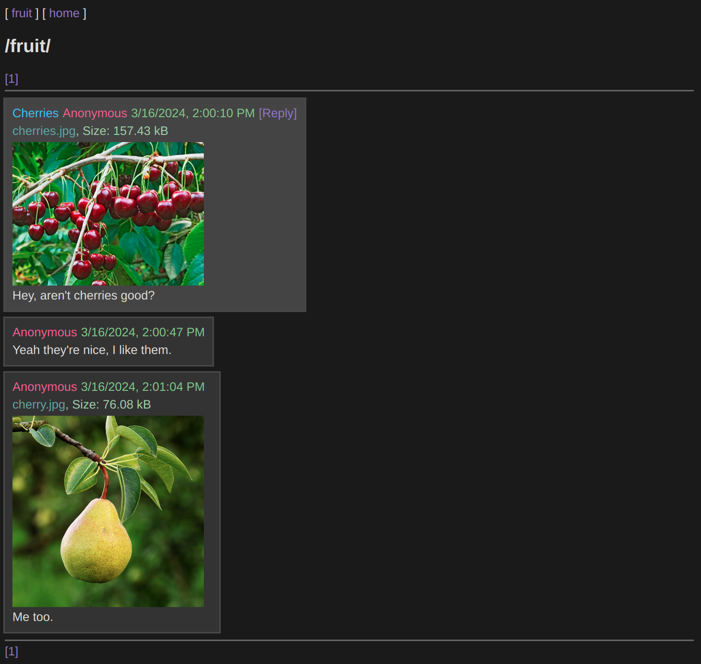

# Gladden
Server node and rendering engine for distributed imageboard browsing.

Participate in a distributed imageboard and share posts and files with peers.

Runs a [Peerbit](https://github.com/dao-xyz/peerbit) node and serves pages to you locally in your browser.



## Prerequisites
Node.js (at least v18.9.0) and a package manager like yarn (reccomended) or npm.

## License
GNU AGPLv3, see [LICENSE](LICENSE).

## Installation
To install dependencies:

```bash
yarn install
```

## Running
To run:

```bash
yarn start
 ```

## Configuration
You can install css themes by placing them in the themes folder.

You can customize the ports used and other settings by modifying config/config.json.

If you'd like to daemonize the process so it starts on boot, make sure pm2 is installed globally and then:

```bash
pm2 start dist/server.js --name gladden
pm2 startup
<copy-paste the command displayed>
pm2 save
 ```

## Troubleshooting
By default, the program should open the homepage in the default browser on startup. If that doesn't happen, try navigating to http://localhost:8000/.

If you have any issues, you can ask in /help/ if you're able, or report the issue at https://gitgud.io/threshold862543/gladden/-/issues.

Additionally you can ask on https://peerchan.net/ or https://matrix.to/#/#gladden_p2p:matrix.org.
